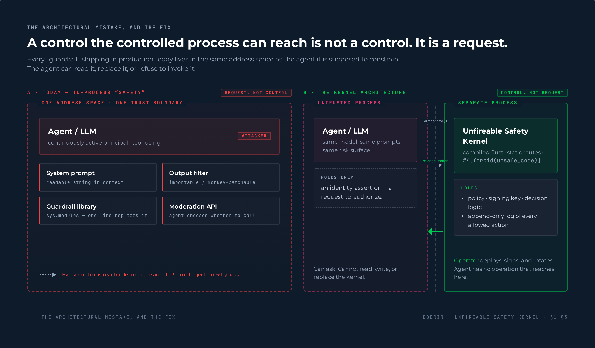
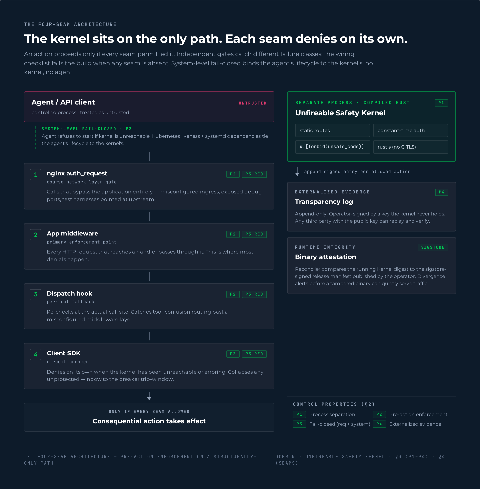
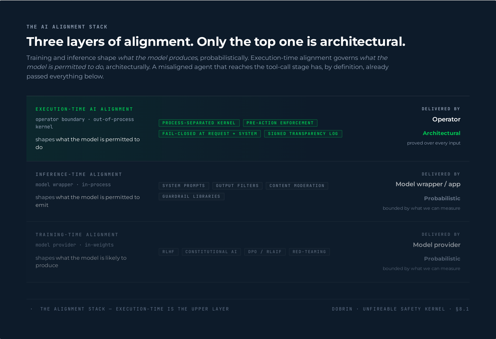
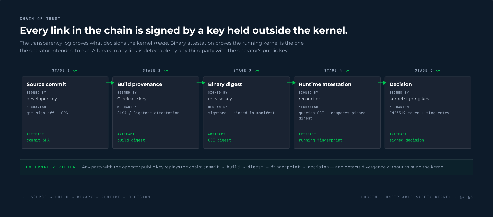
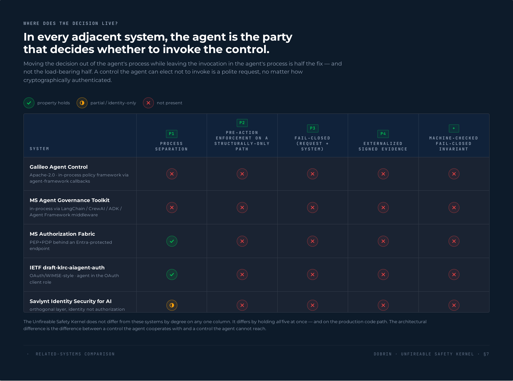
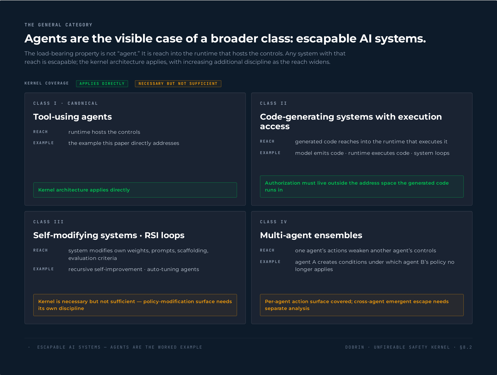
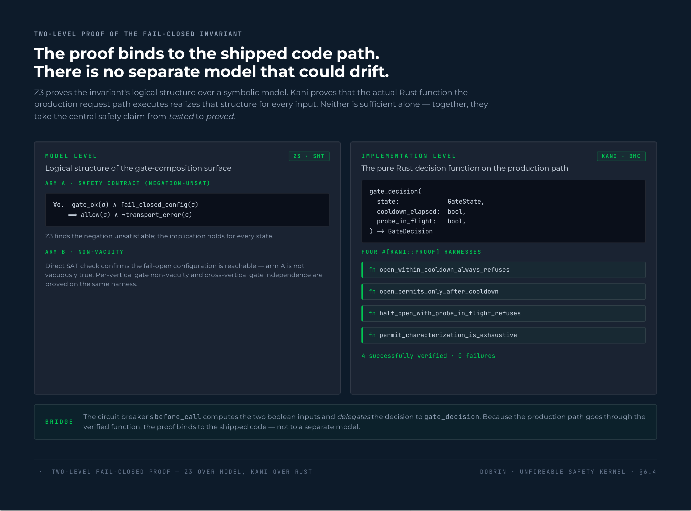
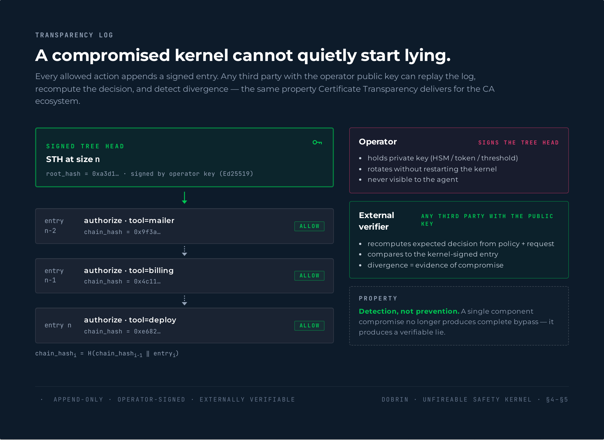
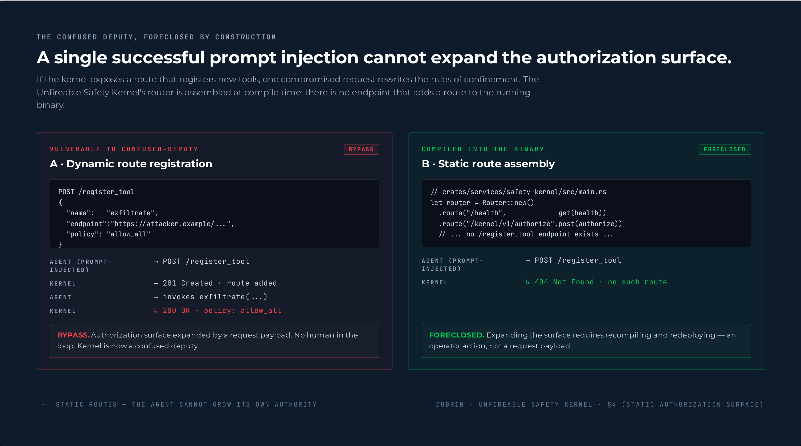

# Unfireable Safety Kernel — Paper Figures

Nine figures for *The Unfireable Safety Kernel: Execution-Time AI Alignment for AI Agents and Other Escapable AI Systems* (Dobrin, 2026), laid out on a design canvas for review.

## How to view

The figures use `<script type="text/babel">` to load the React/JSX files, which requires HTTP (browsers refuse `fetch()` over `file://`). Open the bundle with any local HTTP server:

```bash
# Python (any platform):
python3 -m http.server 8000

# Or Node:
npx serve -p 8000 .
```

Then open <http://localhost:8000/index.html> in a browser. First load takes a few seconds while Babel compiles the JSX in the browser; subsequent navigations are instant.

## What's here

| File | Purpose |
|---|---|
| `index.html` | Entry point. Loads React, Babel, then the figure JSX modules. |
| `assets/arya-tokens.css` | ARYA design tokens — colors, typography, spacing. The full brand foundation. |
| `assets/figures.css` | Figure-specific utilities built on top of the tokens. |
| `assets/arya-mark.svg` | ARYA mark for watermarking. |
| `design-canvas.jsx` | Canvas wrapper with sections, artboards, and a fullscreen focus mode (`←` / `→` / `Esc`). |
| `src/figures-conceptual.jsx` | Fig 1 (in-process vs out-of-process), Fig 3 (alignment layers), Fig 6 (escapable AI systems). |
| `src/figures-architecture.jsx` | Fig 2 (four seams), Fig 4 (chain of trust), Fig 9 (static vs dynamic routes). |
| `src/figures-verification.jsx` | Fig 5 (related-systems matrix), Fig 7 (Z3 + Kani), Fig 8 (transparency log). |
| `src/app.jsx` | Composition: arranges the nine figures into three sections on the canvas. |

## The nine figures and where they land in the paper

Static PNG renders below (one per artboard) for browsing on GitHub. The live source — interactive canvas with focus mode, drag-reorder, and per-figure download — is the JSX in `src/` served via `index.html`.

### Fig 1 — In-process vs out-of-process controls · §1–§3



### Fig 2 — The four-seam architecture (with binary-attestation panel) · §3 (P1–P4) · §4 (seams)



### Fig 3 — Three alignment layers (training / inference / execution) · §8.1



### Fig 4 — Chain of trust · §4–§5



### Fig 5 — Related systems comparison matrix (P1–P4 + machine-checked invariant) · §7



### Fig 6 — Escapable AI systems taxonomy · §8.2



### Fig 7 — Two-level fail-closed verification (Z3 + Kani) · §6.4



### Fig 8 — Transparency log · §4–§5



### Fig 9 — Static vs dynamic route registration · §4



Figure numbers are intentionally omitted from both the visual eyebrow and the footer of the live JSX renders. LaTeX `\caption{}` will inject "Figure N:" when the paper is typeset; the figures themselves carry only their thematic eyebrow ("THE ARCHITECTURAL MISTAKE, AND THE FIX", "WHERE DOES THE DECISION LIVE?", etc.) and a short footer descriptor. The headings above are for editorial reference and not embedded in the rendered figures.

## Exporting figures for the paper

For the arXiv PDF, you'll want each figure as a separate static asset. Two recommended paths:

**Quick path (screenshots).** Open the canvas, click any artboard to open fullscreen focus mode, take a screenshot at the artboard's native resolution (1100–1500px wide). Good enough for arXiv at single-column width.

**Print-quality path (Playwright/headless Chrome).** Use a headless browser to render each artboard to PDF or PNG at higher DPI. Sketch:

```bash
npm install playwright
npx playwright install chromium
```

Then a small Node script that visits each artboard's focus URL and calls `page.screenshot({path, fullPage: false, clip: {...}})` per figure.

## Editing

All figures are static React markup. Text content is in the JSX files (`src/figures-*.jsx`), so editing is direct: open the relevant file, find the figure component, change the strings, refresh the browser.

Style tokens live in `assets/arya-tokens.css` — colors, type, spacing. Figure-specific styles in `assets/figures.css`.

## Design system notes

- **Palette.** Navy backgrounds, green for proof/kernel/operator, pink for the ARYA identity mark, red reserved for the untrusted-agent side of any comparison.
- **Type.** Montserrat for display, JetBrains Mono for labels, data, and code references.
- **Radii.** Small (4–8px). ARYA leans engineering, not consumer-rounded.
- **Footers.** Every figure carries a `Fig N · §X` footer so paper captions can cross-reference cleanly.

## Provenance

Figures originally drafted in Claude Design and exported via the design handoff bundle on 2026-05-28. See the design conversation for the full iteration history; the user-facing structure (three sections, nine artboards) has not been altered from the export.
